# Comparative Charts Report

## Dataset description

- Instances: 1
- Families: 1
- Algorithms: 11
- n range: 2–2
- m range: 2–2

## Summary statistics

| Algorithm | Wall time median [IQR] (s) | Memory median [IQR] (MB) | Gap median [IQR] (%) | Objective median [IQR] |
|---|---:|---:|---:|---:|
| branch-and-bound | 0.001 [0.001, 0.001] | 6.5 [6.5, 6.5] | 0.00 [0.00, 0.00] | 30.3687 [29.8451, 30.8923] |
| brute-force | 0.001 [0.001, 0.001] | 6.5 [6.5, 6.5] | 0.00 [0.00, 0.00] | 30.3687 [29.8451, 30.8923] |
| genetic | 0.131 [0.077, 0.184] | 7.1 [7.1, 7.1] | 38.17 [31.58, 44.75] | 30.3687 [29.8451, 30.8923] |
| greedy | 0.000 [0.000, 0.000] | 6.6 [6.6, 6.6] | 38.17 [31.58, 44.75] | 30.3687 [29.8451, 30.8923] |
| ip-kont | 0.001 [0.000, 0.001] | 6.7 [6.7, 6.7] | 0.00 [0.00, 0.00] | 30.3687 [29.8451, 30.8923] |
| local-search | 0.001 [0.001, 0.001] | 6.8 [6.7, 6.8] | 38.17 [31.58, 44.75] | 30.3687 [29.8451, 30.8923] |
| lp-rounding | 0.001 [0.000, 0.001] | 6.9 [6.8, 6.9] | 0.00 [0.00, 0.00] | 30.3687 [29.8451, 30.8923] |
| nn | 0.000 [0.000, 0.000] | 6.9 [6.9, 6.9] | 3036.87 [2984.51, 3089.23] | 30.3687 [29.8451, 30.8923] |
| primal-dual | 0.000 [0.000, 0.000] | 7.0 [7.0, 7.0] | 99.98 [99.97, 99.99] | 30.3687 [29.8451, 30.8923] |
| sa | 0.028 [0.016, 0.039] | 7.0 [7.0, 7.1] | 38.17 [31.58, 44.75] | 30.3687 [29.8451, 30.8923] |
| shifting | 0.005 [0.003, 0.007] | 7.0 [7.0, 7.1] | 38.17 [31.58, 44.75] | 30.3687 [29.8451, 30.8923] |

## Figures

### A1_runtime_bar_preflight_sample

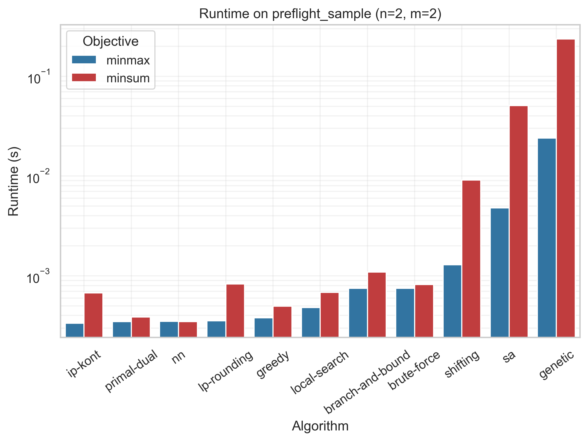

Runtime across algorithms and objectives for preflight_sample. **Takeaway:** Best observed runtime: 0.000335584 s.

Vector PDF: [A1_runtime_bar_preflight_sample.pdf](A1_runtime_bar_preflight_sample.pdf)

### A2_runtime_box

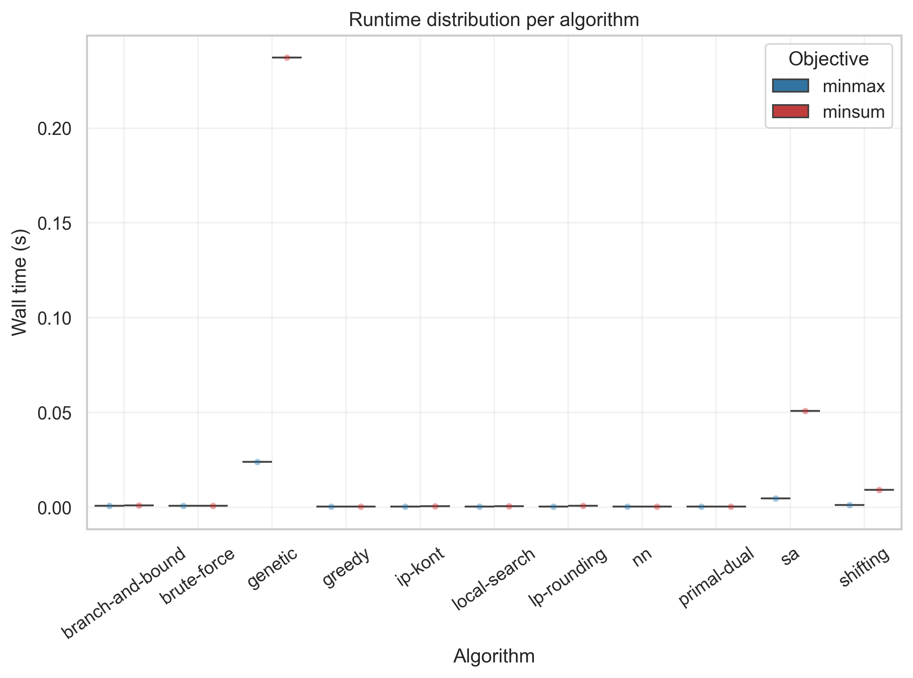

Runtime distribution per algorithm. **Takeaway:** Compare per-algorithm distributions across the available instances.

Vector PDF: [A2_runtime_box.pdf](A2_runtime_box.pdf)

### A3_runtime_vs_n_m25

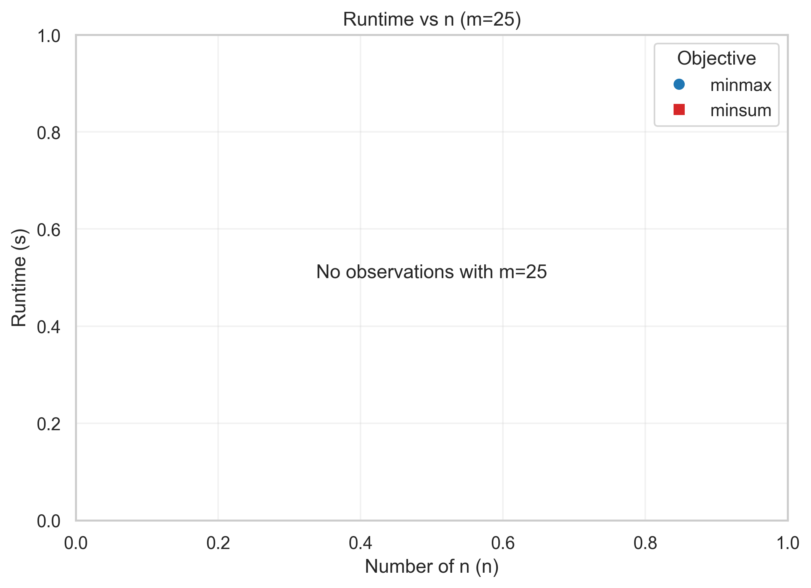

Scaling of runtime (s) against n with m fixed at 25. **Takeaway:** Lines show medians and shaded regions show interquartile ranges.

Vector PDF: [A3_runtime_vs_n_m25.pdf](A3_runtime_vs_n_m25.pdf)

### A4_runtime_vs_m_n500

Scaling of runtime (s) against m with n fixed at 500. **Takeaway:** Lines show medians and shaded regions show interquartile ranges.

Vector PDF: [A4_runtime_vs_m_n500.pdf](A4_runtime_vs_m_n500.pdf)

### A5_runtime_heatmap

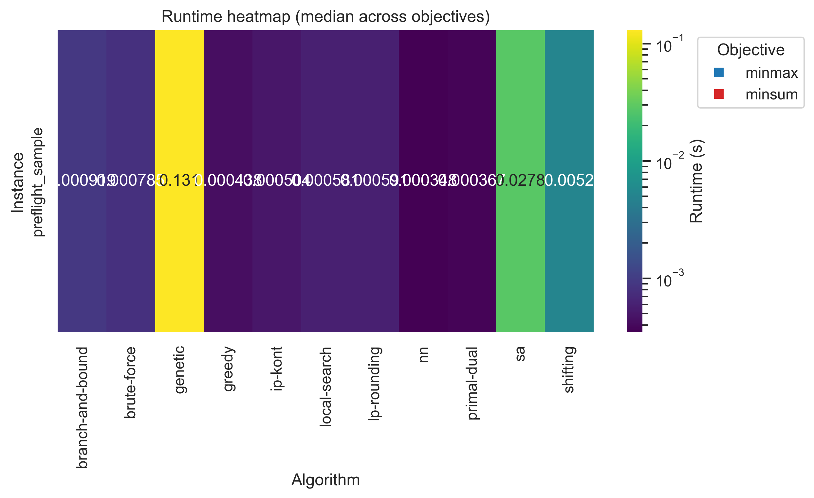

Runtime heatmap (median across objectives). **Takeaway:** Cells summarize median values across objectives.

Vector PDF: [A5_runtime_heatmap.pdf](A5_runtime_heatmap.pdf)

### A6_runtime_ecdf

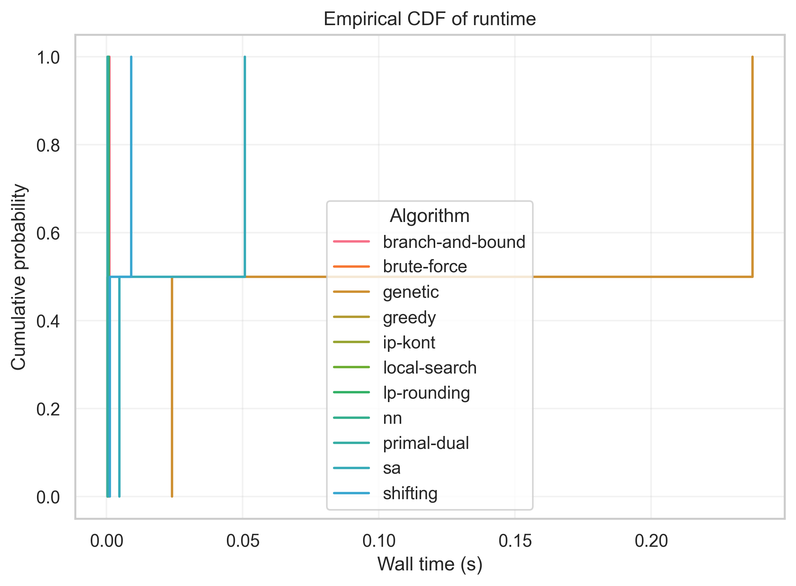

Empirical cumulative distribution of runtime per algorithm. **Takeaway:** Curves further left indicate faster runs.

Vector PDF: [A6_runtime_ecdf.pdf](A6_runtime_ecdf.pdf)

### B1_memory_bar_preflight_sample

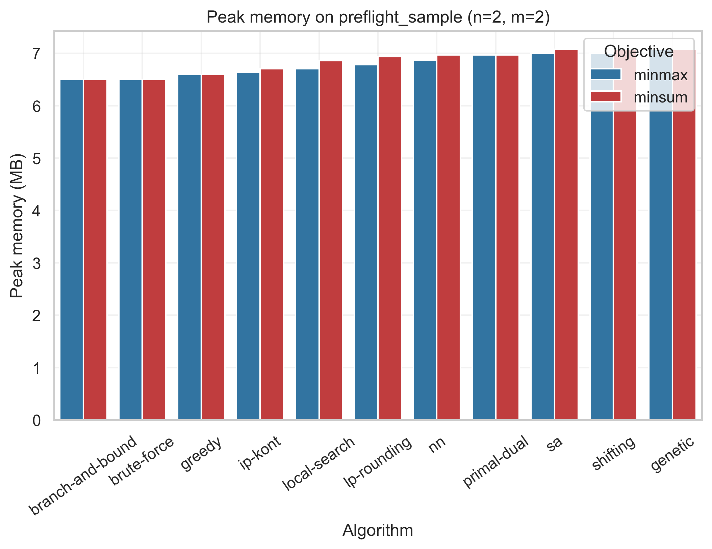

Peak memory across algorithms and objectives for preflight_sample. **Takeaway:** Best observed peak memory: 6.5 MB.

Vector PDF: [B1_memory_bar_preflight_sample.pdf](B1_memory_bar_preflight_sample.pdf)

### B2_memory_box

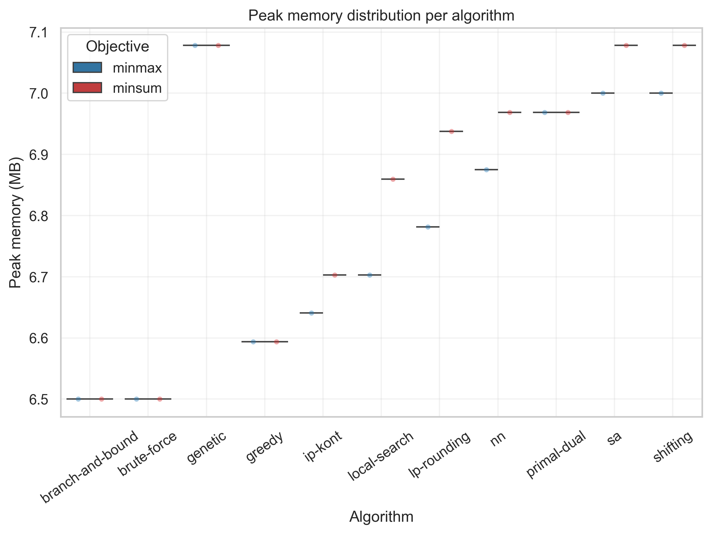

Peak memory distribution per algorithm. **Takeaway:** Compare per-algorithm distributions across the available instances.

Vector PDF: [B2_memory_box.pdf](B2_memory_box.pdf)

### B3_memory_vs_n_m25

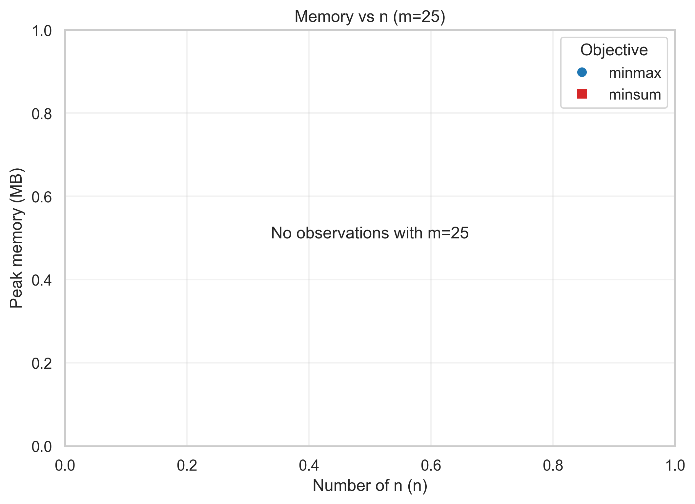

Scaling of peak memory (mb) against n with m fixed at 25. **Takeaway:** Lines show medians and shaded regions show interquartile ranges.

Vector PDF: [B3_memory_vs_n_m25.pdf](B3_memory_vs_n_m25.pdf)

### B4_memory_heatmap

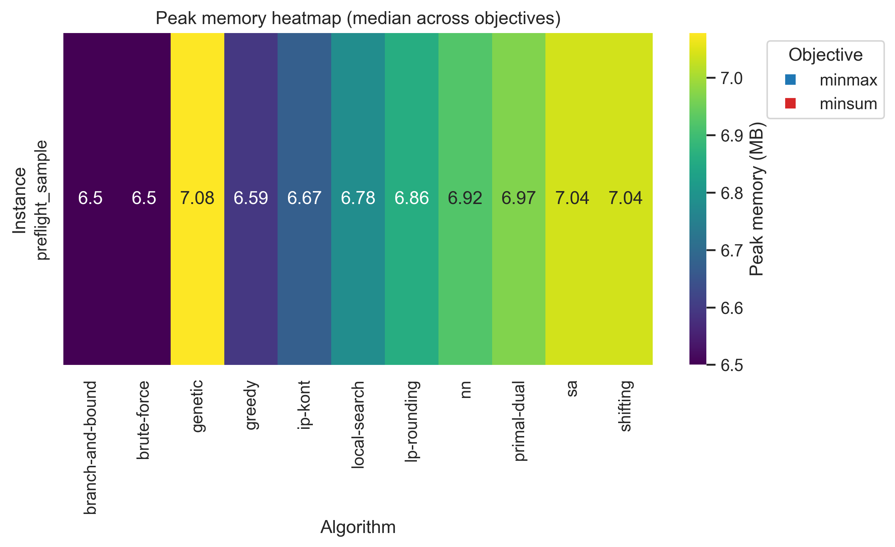

Peak memory heatmap (median across objectives). **Takeaway:** Cells summarize median values across objectives.

Vector PDF: [B4_memory_heatmap.pdf](B4_memory_heatmap.pdf)

### B5_memory_vs_m_n500

Scaling of peak memory (mb) against m with n fixed at 500. **Takeaway:** Lines show medians and shaded regions show interquartile ranges.

Vector PDF: [B5_memory_vs_m_n500.pdf](B5_memory_vs_m_n500.pdf)

### C1_gap_boxplot

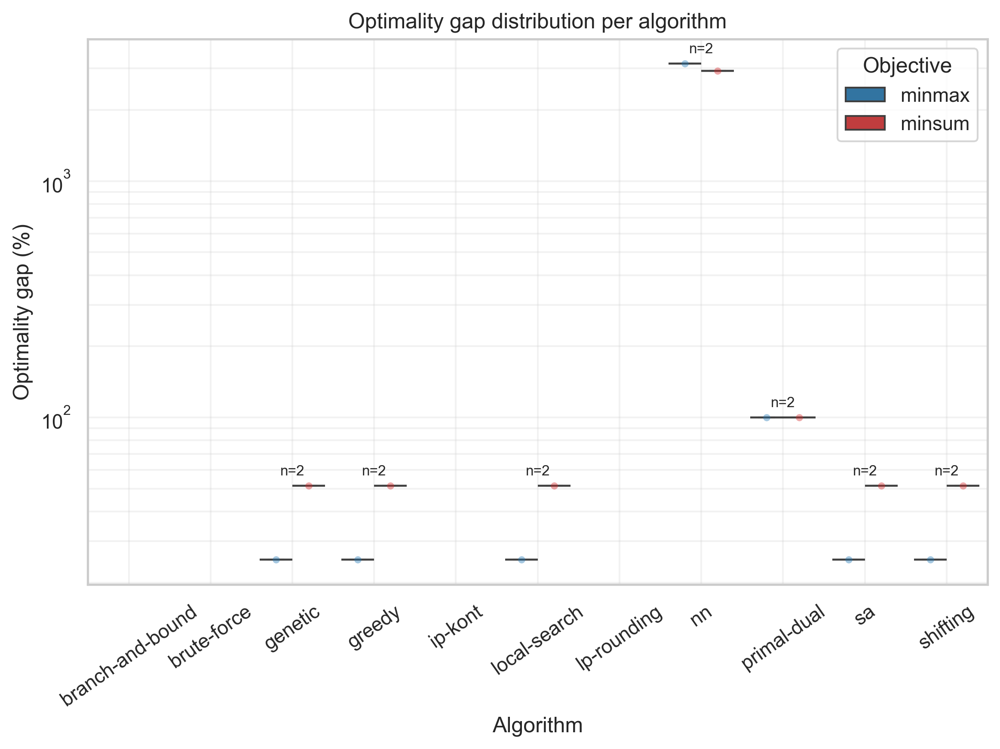

Optimality gap distribution per algorithm. **Takeaway:** Compare per-algorithm distributions across the available instances.

Vector PDF: [C1_gap_boxplot.pdf](C1_gap_boxplot.pdf)

### C2_gap_ecdf

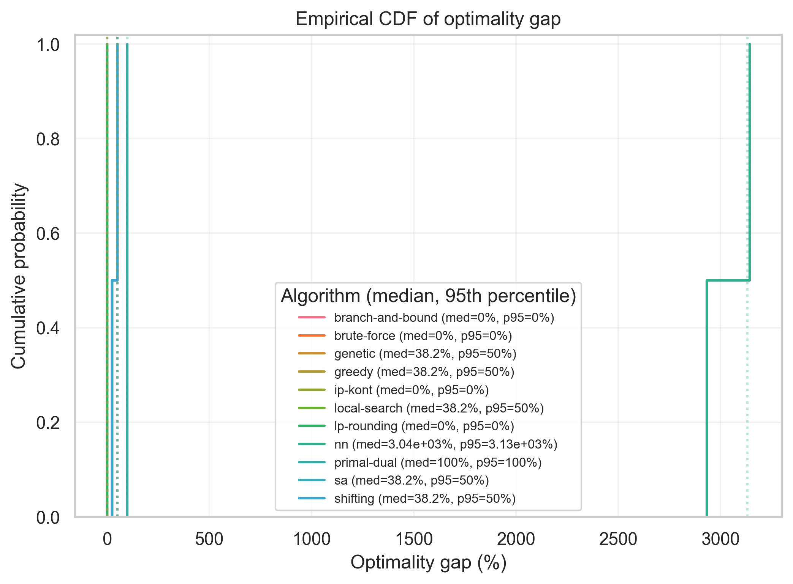

Empirical cumulative distribution of optimality gaps, with median and 95th-percentile values in each legend entry. **Takeaway:** The curve furthest left has lower gaps overall.

Vector PDF: [C2_gap_ecdf.pdf](C2_gap_ecdf.pdf)

### C3_gap_vs_n

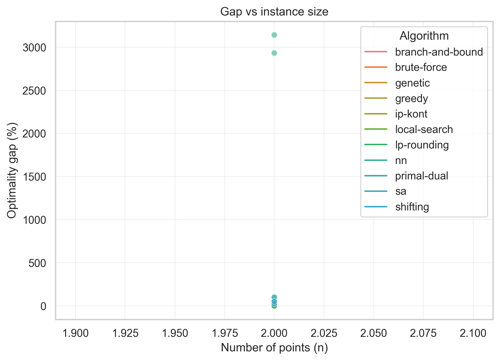

Scatter points and LOWESS-smoothed trends show optimality gap against point count. **Takeaway:** Lower trend lines indicate smaller gaps as instance size changes.

Vector PDF: [C3_gap_vs_n.pdf](C3_gap_vs_n.pdf)

### C4_objective_value_vs_n_m25

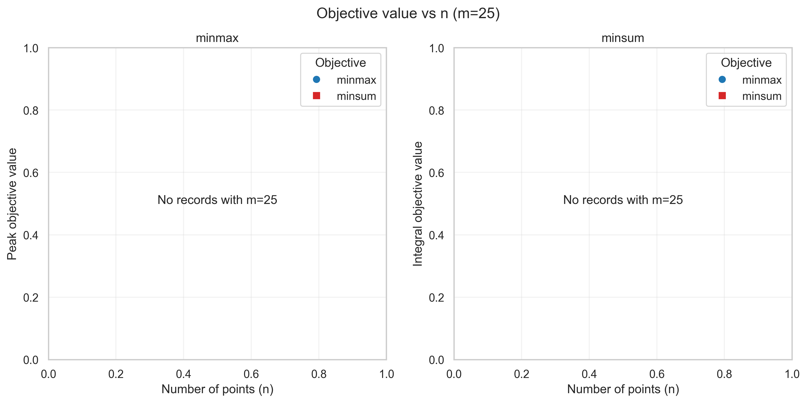

MinMax peak and MinSum integral objective values versus instance size; lines are medians with IQR bands. **Takeaway:** Compare objective trends separately for peak and integral cost.

Vector PDF: [C4_objective_value_vs_n_m25.pdf](C4_objective_value_vs_n_m25.pdf)

### C5_gap_vs_runtime

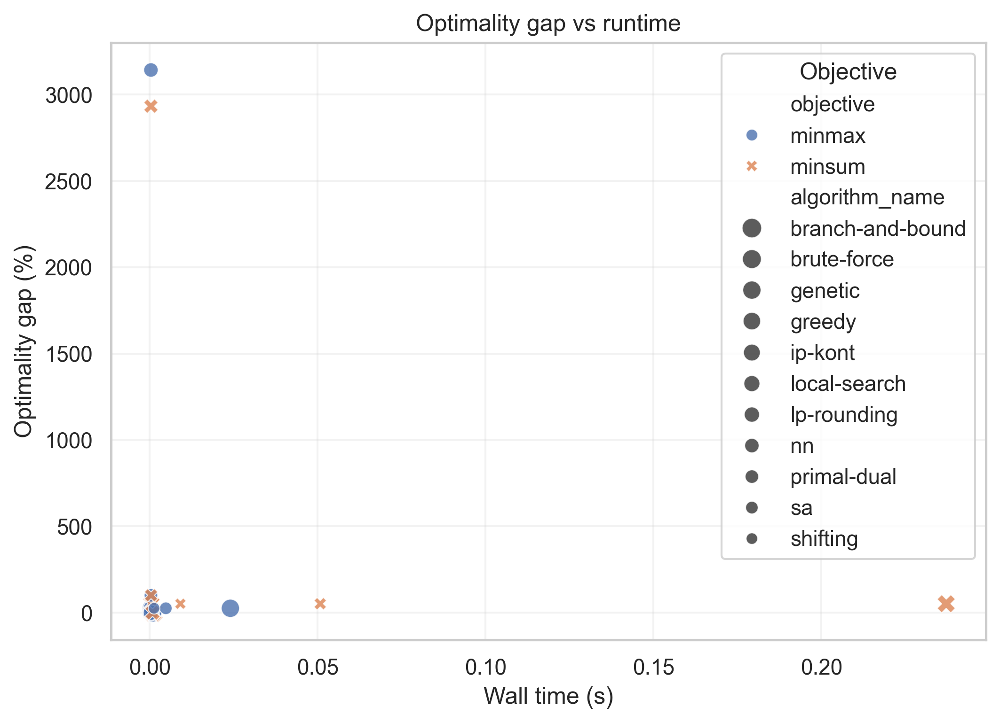

Optimality gap vs runtime. **Takeaway:** Each point represents one algorithm/objective run.

Vector PDF: [C5_gap_vs_runtime.pdf](C5_gap_vs_runtime.pdf)

### C6_objective_boxplot

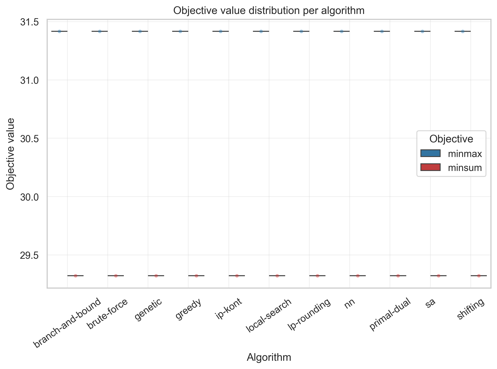

Objective value distribution per algorithm. **Takeaway:** Compare per-algorithm distributions across the available instances.

Vector PDF: [C6_objective_boxplot.pdf](C6_objective_boxplot.pdf)

### D1_pareto_preflight_sample

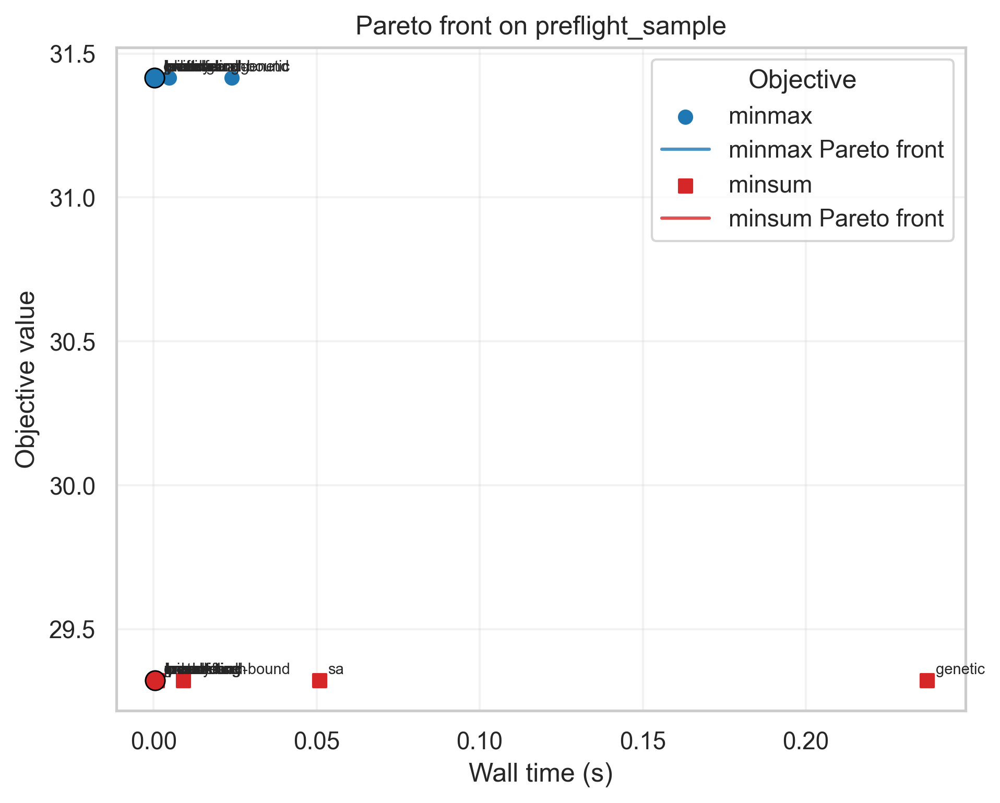

Runtime-quality trade-offs for preflight_sample. **Takeaway:** Points on a front are non-dominated in runtime and objective.

Vector PDF: [D1_pareto_preflight_sample.pdf](D1_pareto_preflight_sample.pdf)

### D2_pareto_aggregated

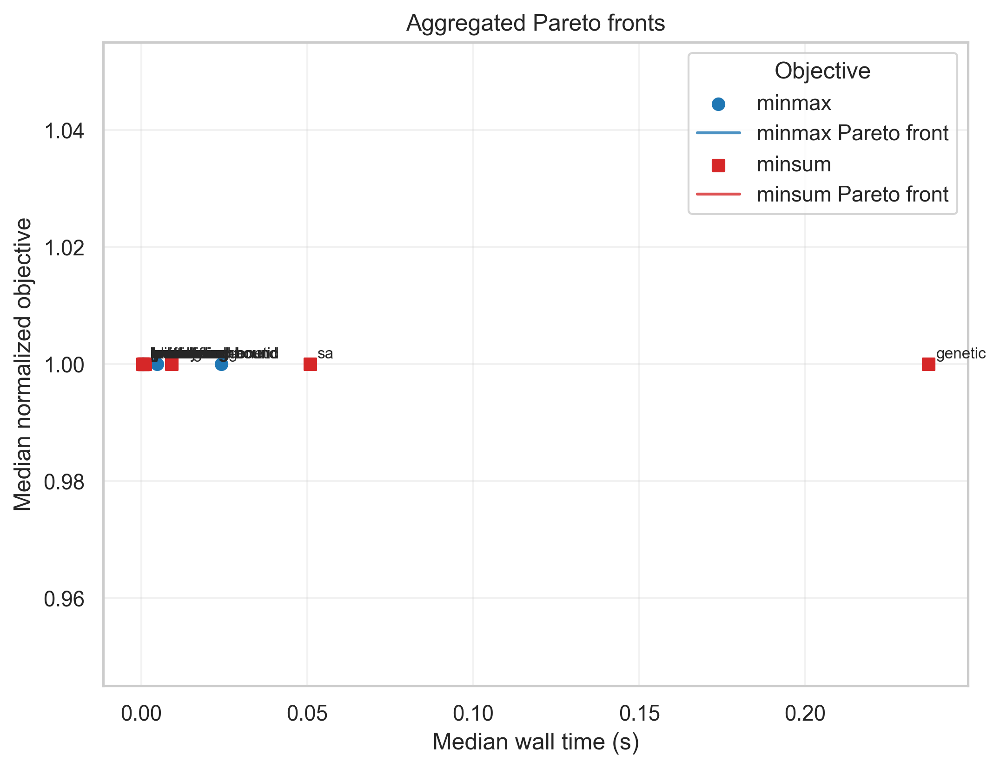

Runtime-quality trade-offs aggregated by algorithm and objective. **Takeaway:** Points on a front are non-dominated in median runtime and normalized objective.

Vector PDF: [D2_pareto_aggregated.pdf](D2_pareto_aggregated.pdf)

### E2_minmax_quality_heatmap

MinMax quality heatmap (rank per instance). **Takeaway:** Lower ranks indicate better objective values within each instance.

Vector PDF: [E2_minmax_quality_heatmap.pdf](E2_minmax_quality_heatmap.pdf)

### E3_minsum_quality_heatmap

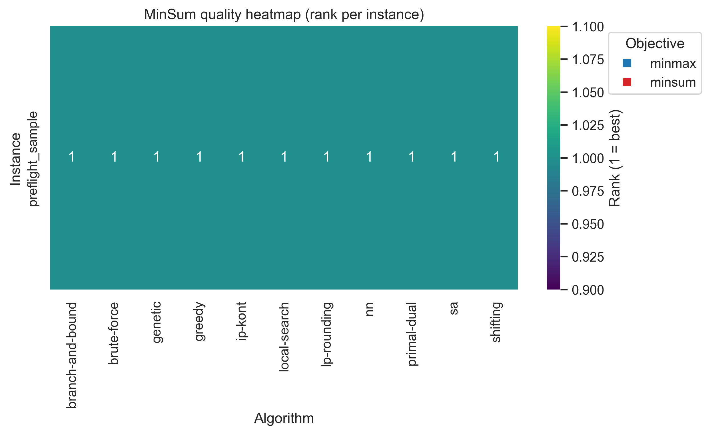

MinSum quality heatmap (rank per instance). **Takeaway:** Lower ranks indicate better objective values within each instance.

Vector PDF: [E3_minsum_quality_heatmap.pdf](E3_minsum_quality_heatmap.pdf)

### D3_tradeoff_branch-and-bound_minmax

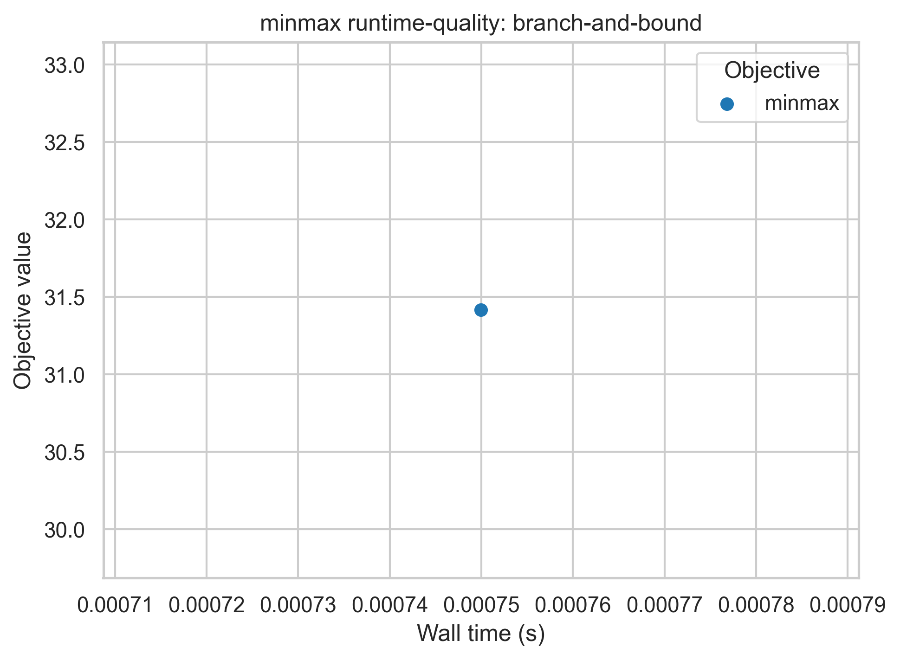

Runtime-quality observations for branch-and-bound under minmax. **Takeaway:** Faster and lower points are preferred.

Vector PDF: [D3_tradeoff_branch-and-bound_minmax.pdf](D3_tradeoff_branch-and-bound_minmax.pdf)

### D3_tradeoff_branch-and-bound_minsum

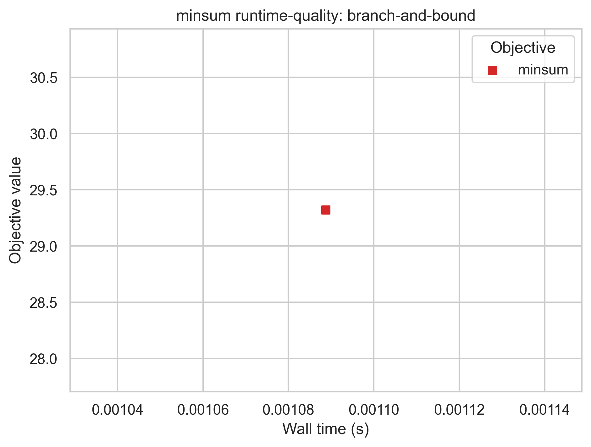

Runtime-quality observations for branch-and-bound under minsum. **Takeaway:** Faster and lower points are preferred.

Vector PDF: [D3_tradeoff_branch-and-bound_minsum.pdf](D3_tradeoff_branch-and-bound_minsum.pdf)

### D3_tradeoff_brute-force_minmax

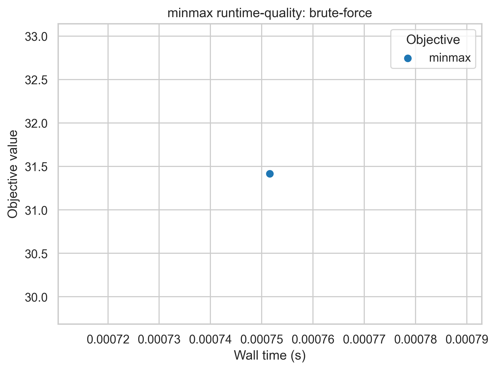

Runtime-quality observations for brute-force under minmax. **Takeaway:** Faster and lower points are preferred.

Vector PDF: [D3_tradeoff_brute-force_minmax.pdf](D3_tradeoff_brute-force_minmax.pdf)

### D3_tradeoff_brute-force_minsum

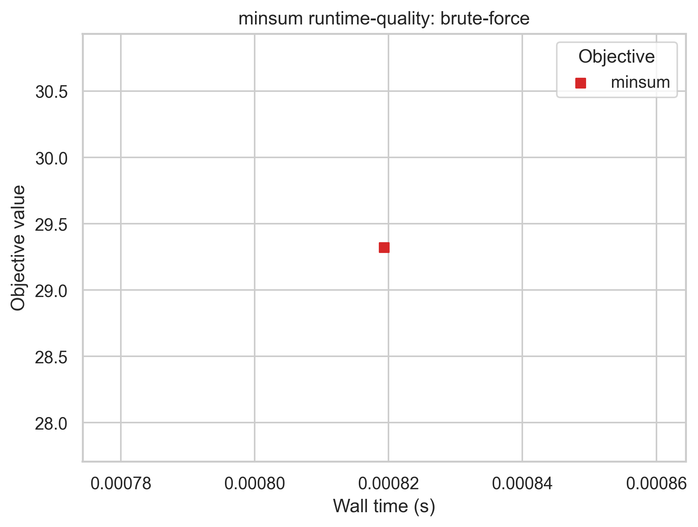

Runtime-quality observations for brute-force under minsum. **Takeaway:** Faster and lower points are preferred.

Vector PDF: [D3_tradeoff_brute-force_minsum.pdf](D3_tradeoff_brute-force_minsum.pdf)

### D3_tradeoff_genetic_minmax

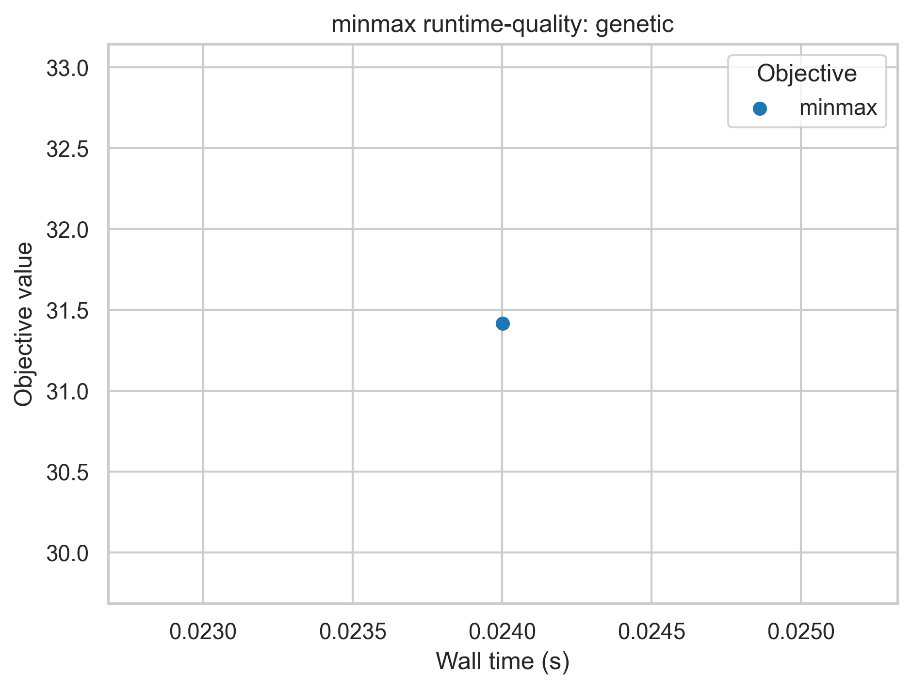

Runtime-quality observations for genetic under minmax. **Takeaway:** Faster and lower points are preferred.

Vector PDF: [D3_tradeoff_genetic_minmax.pdf](D3_tradeoff_genetic_minmax.pdf)

### D3_tradeoff_genetic_minsum

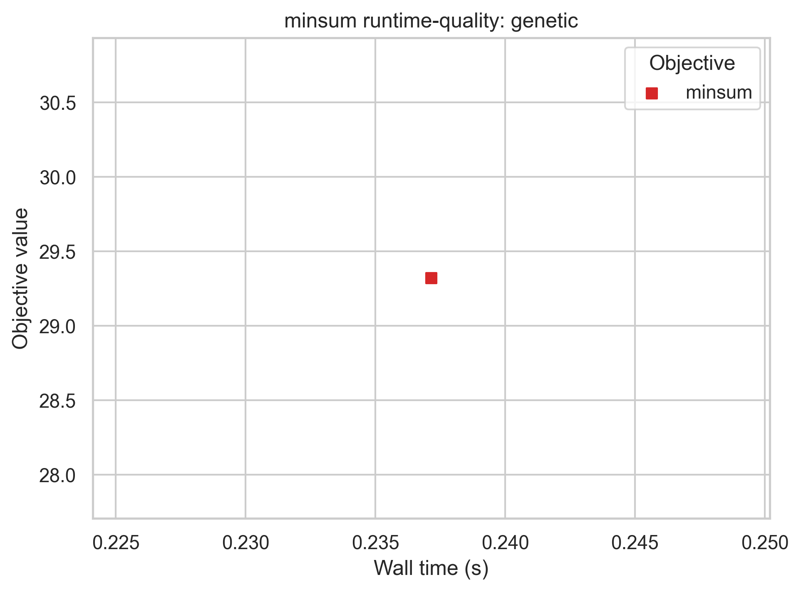

Runtime-quality observations for genetic under minsum. **Takeaway:** Faster and lower points are preferred.

Vector PDF: [D3_tradeoff_genetic_minsum.pdf](D3_tradeoff_genetic_minsum.pdf)

### D3_tradeoff_greedy_minmax

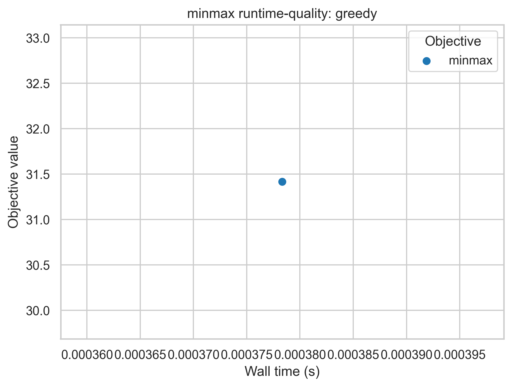

Runtime-quality observations for greedy under minmax. **Takeaway:** Faster and lower points are preferred.

Vector PDF: [D3_tradeoff_greedy_minmax.pdf](D3_tradeoff_greedy_minmax.pdf)

### D3_tradeoff_greedy_minsum

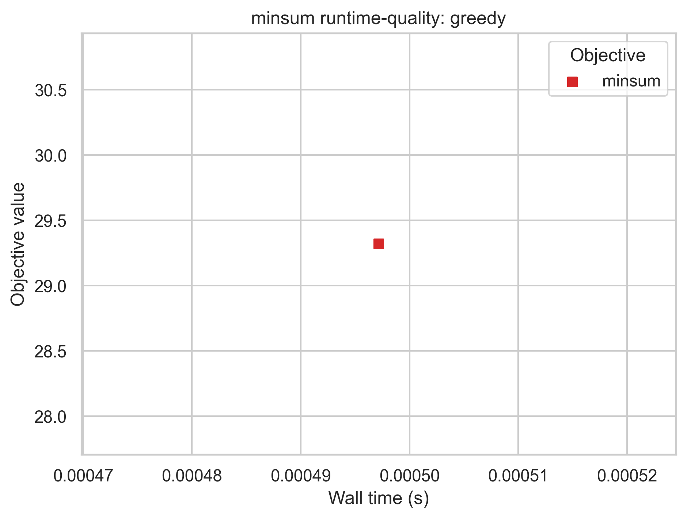

Runtime-quality observations for greedy under minsum. **Takeaway:** Faster and lower points are preferred.

Vector PDF: [D3_tradeoff_greedy_minsum.pdf](D3_tradeoff_greedy_minsum.pdf)

### D3_tradeoff_ip-kont_minmax

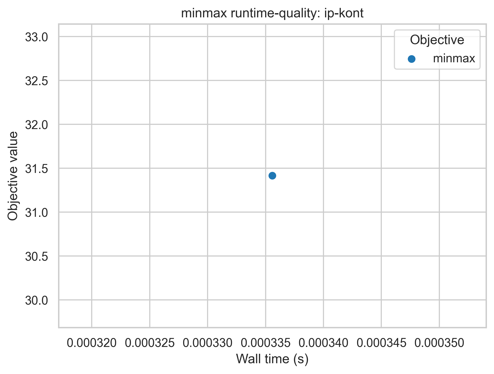

Runtime-quality observations for ip-kont under minmax. **Takeaway:** Faster and lower points are preferred.

Vector PDF: [D3_tradeoff_ip-kont_minmax.pdf](D3_tradeoff_ip-kont_minmax.pdf)

### D3_tradeoff_ip-kont_minsum

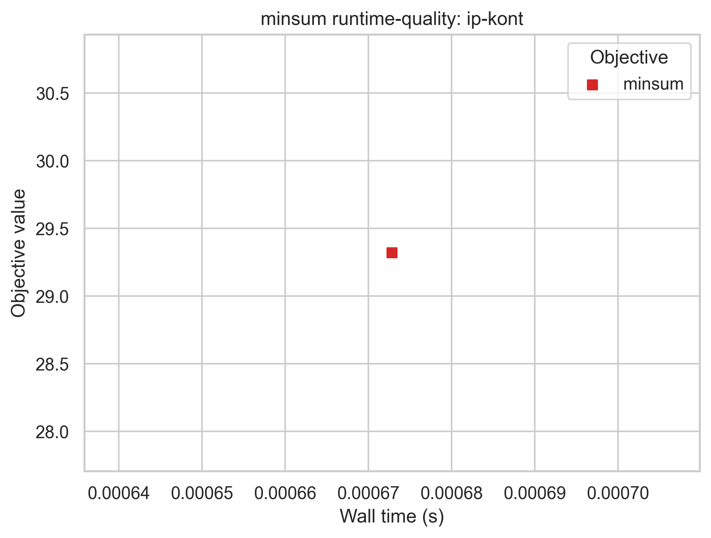

Runtime-quality observations for ip-kont under minsum. **Takeaway:** Faster and lower points are preferred.

Vector PDF: [D3_tradeoff_ip-kont_minsum.pdf](D3_tradeoff_ip-kont_minsum.pdf)

### D3_tradeoff_local-search_minmax

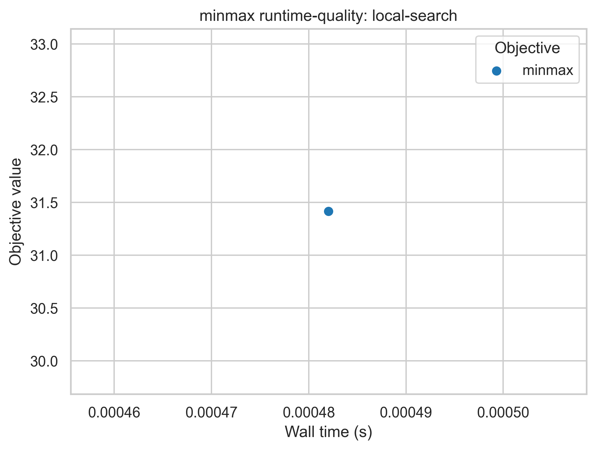

Runtime-quality observations for local-search under minmax. **Takeaway:** Faster and lower points are preferred.

Vector PDF: [D3_tradeoff_local-search_minmax.pdf](D3_tradeoff_local-search_minmax.pdf)

### D3_tradeoff_local-search_minsum

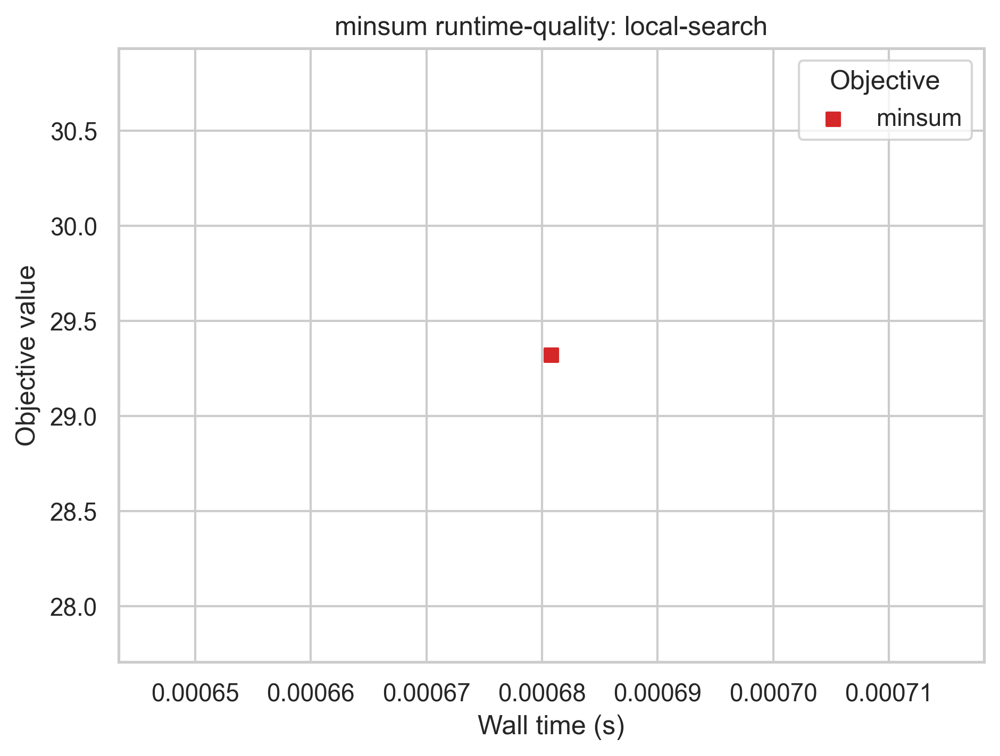

Runtime-quality observations for local-search under minsum. **Takeaway:** Faster and lower points are preferred.

Vector PDF: [D3_tradeoff_local-search_minsum.pdf](D3_tradeoff_local-search_minsum.pdf)

### D3_tradeoff_lp-rounding_minmax

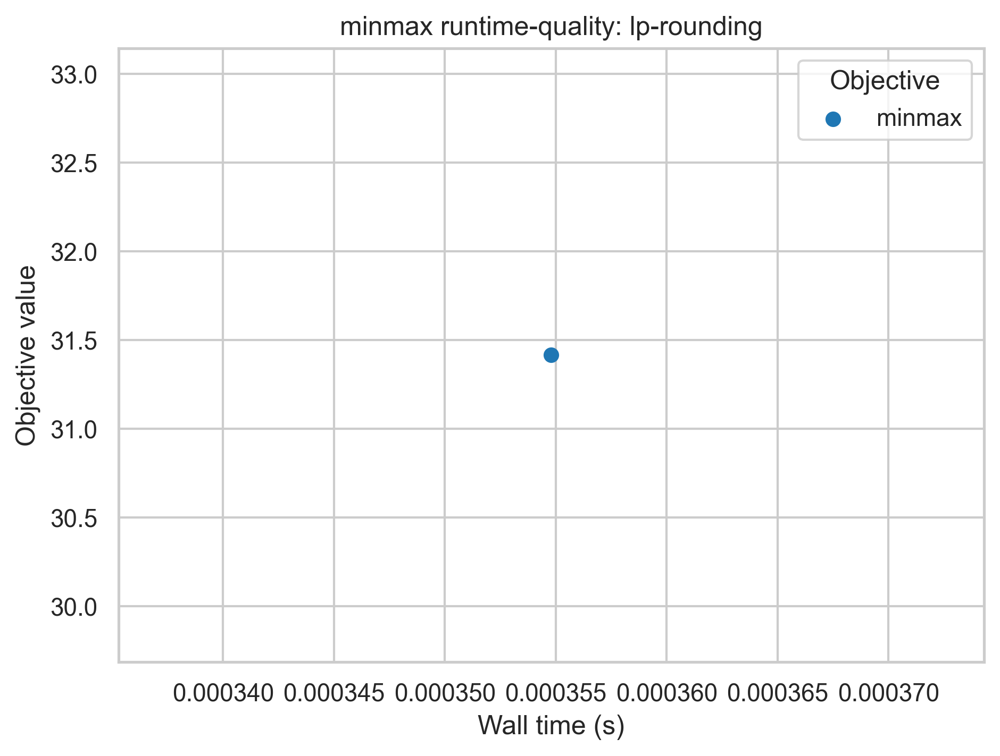

Runtime-quality observations for lp-rounding under minmax. **Takeaway:** Faster and lower points are preferred.

Vector PDF: [D3_tradeoff_lp-rounding_minmax.pdf](D3_tradeoff_lp-rounding_minmax.pdf)

### D3_tradeoff_lp-rounding_minsum

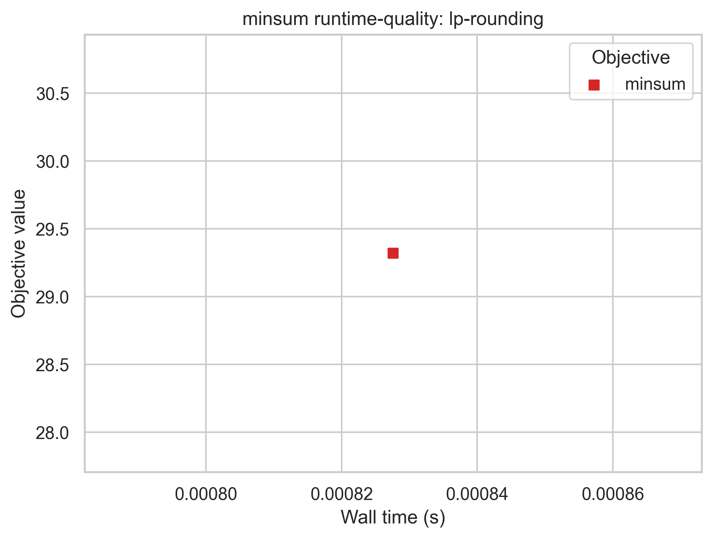

Runtime-quality observations for lp-rounding under minsum. **Takeaway:** Faster and lower points are preferred.

Vector PDF: [D3_tradeoff_lp-rounding_minsum.pdf](D3_tradeoff_lp-rounding_minsum.pdf)

### D3_tradeoff_nn_minmax

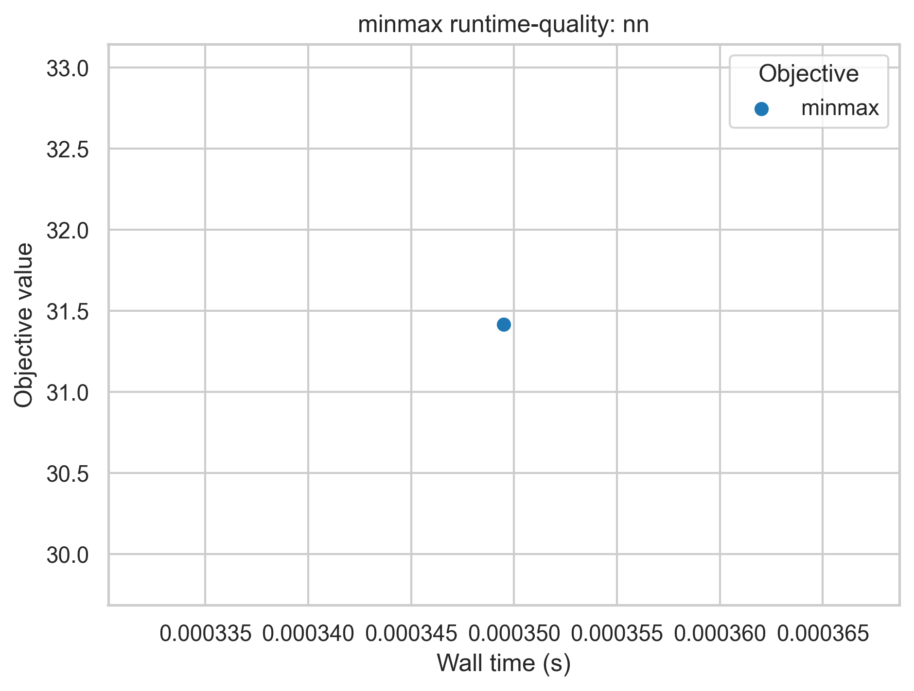

Runtime-quality observations for nn under minmax. **Takeaway:** Faster and lower points are preferred.

Vector PDF: [D3_tradeoff_nn_minmax.pdf](D3_tradeoff_nn_minmax.pdf)

### D3_tradeoff_nn_minsum

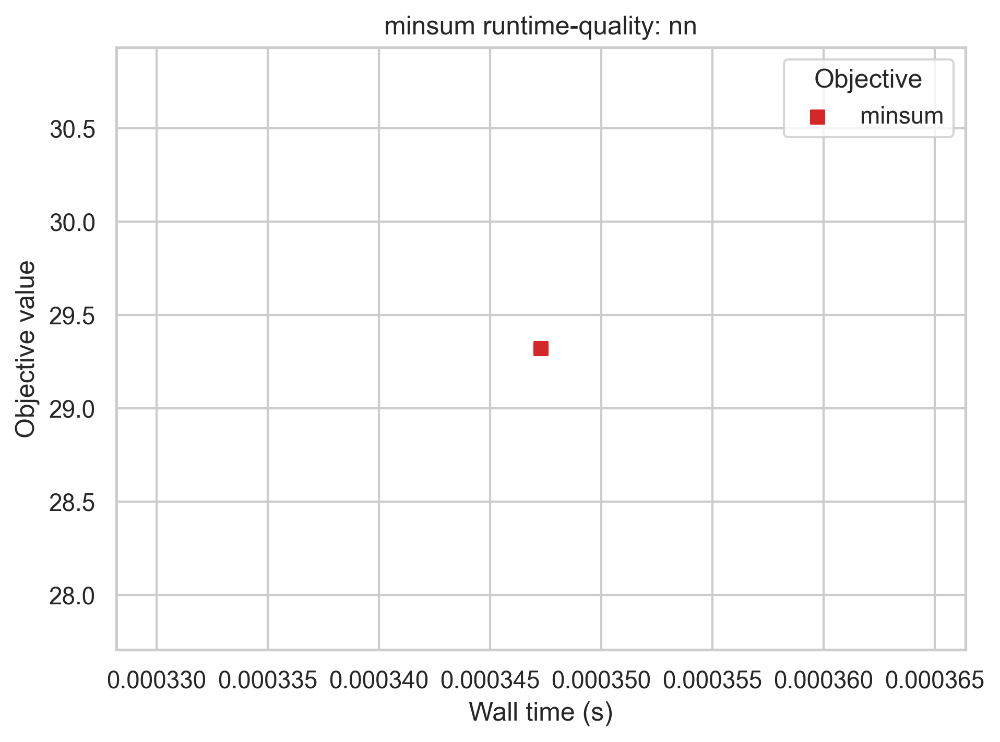

Runtime-quality observations for nn under minsum. **Takeaway:** Faster and lower points are preferred.

Vector PDF: [D3_tradeoff_nn_minsum.pdf](D3_tradeoff_nn_minsum.pdf)

### D3_tradeoff_primal-dual_minmax

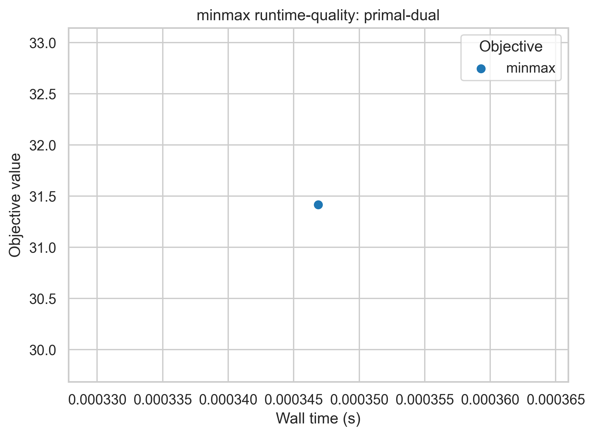

Runtime-quality observations for primal-dual under minmax. **Takeaway:** Faster and lower points are preferred.

Vector PDF: [D3_tradeoff_primal-dual_minmax.pdf](D3_tradeoff_primal-dual_minmax.pdf)

### D3_tradeoff_primal-dual_minsum

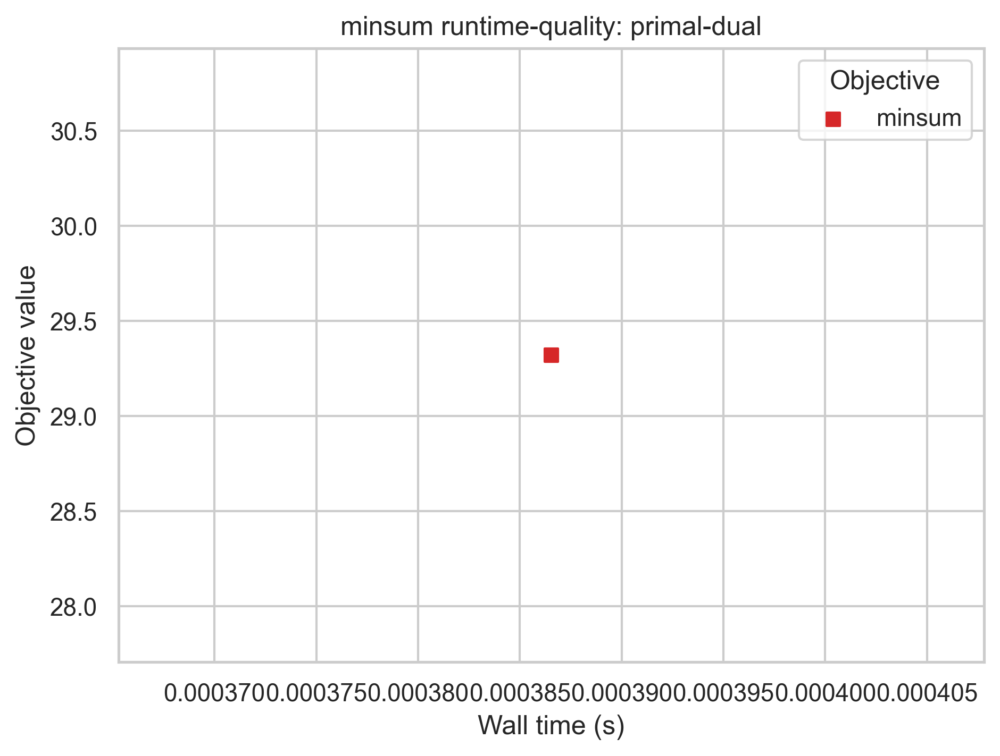

Runtime-quality observations for primal-dual under minsum. **Takeaway:** Faster and lower points are preferred.

Vector PDF: [D3_tradeoff_primal-dual_minsum.pdf](D3_tradeoff_primal-dual_minsum.pdf)

### D3_tradeoff_sa_minmax

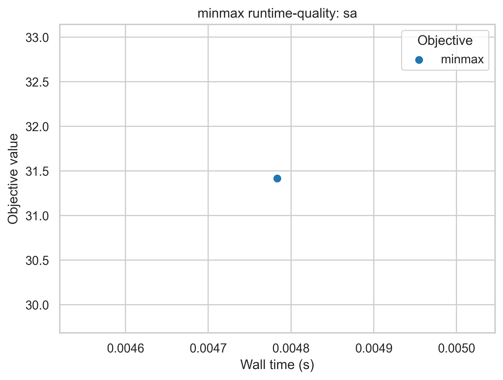

Runtime-quality observations for sa under minmax. **Takeaway:** Faster and lower points are preferred.

Vector PDF: [D3_tradeoff_sa_minmax.pdf](D3_tradeoff_sa_minmax.pdf)

### D3_tradeoff_sa_minsum

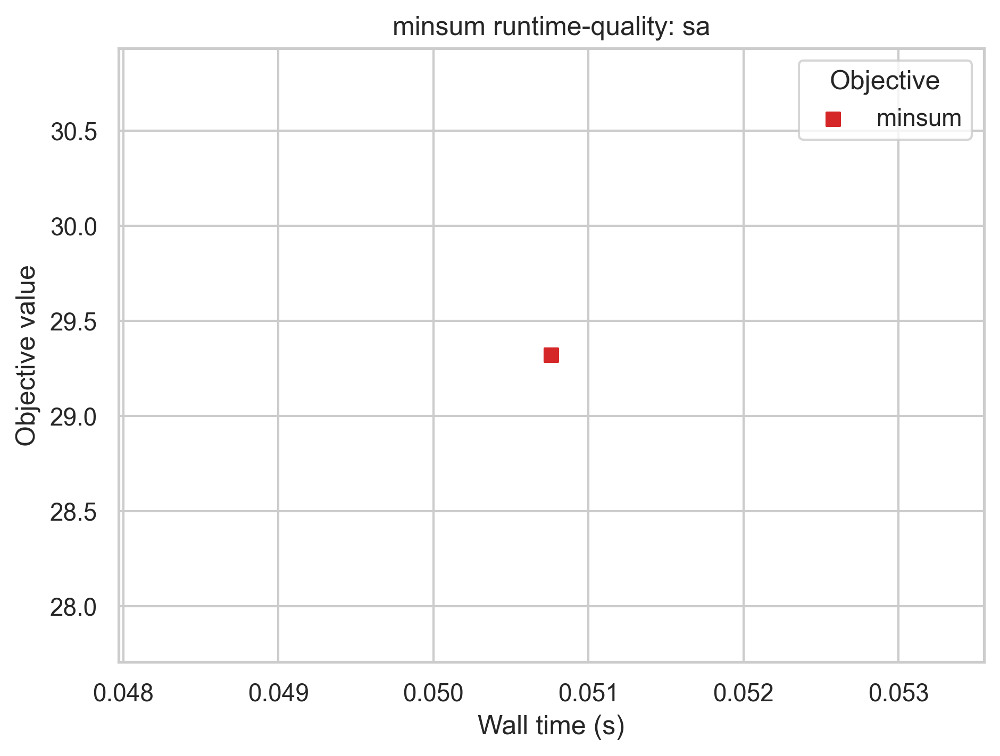

Runtime-quality observations for sa under minsum. **Takeaway:** Faster and lower points are preferred.

Vector PDF: [D3_tradeoff_sa_minsum.pdf](D3_tradeoff_sa_minsum.pdf)

### D3_tradeoff_shifting_minmax

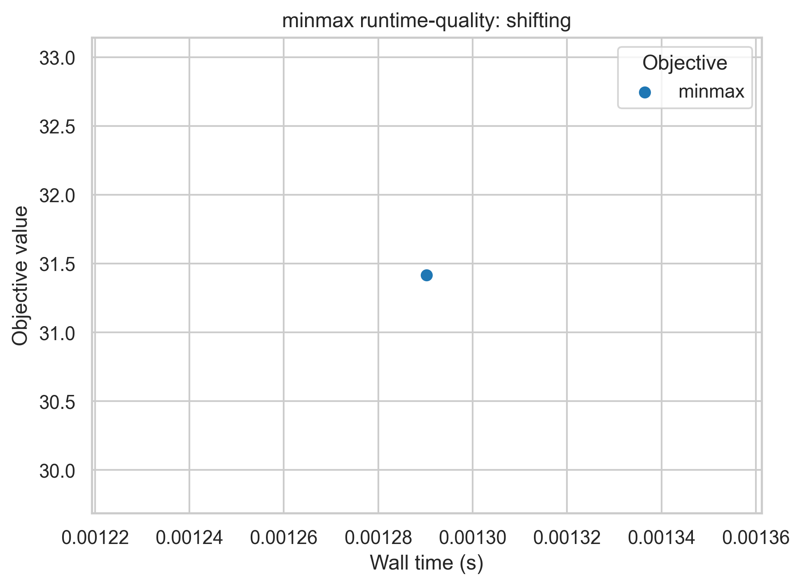

Runtime-quality observations for shifting under minmax. **Takeaway:** Faster and lower points are preferred.

Vector PDF: [D3_tradeoff_shifting_minmax.pdf](D3_tradeoff_shifting_minmax.pdf)

### D3_tradeoff_shifting_minsum

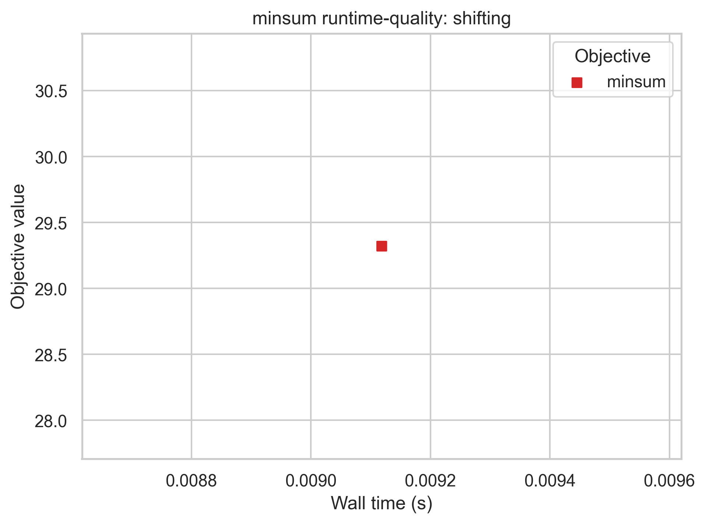

Runtime-quality observations for shifting under minsum. **Takeaway:** Faster and lower points are preferred.

Vector PDF: [D3_tradeoff_shifting_minsum.pdf](D3_tradeoff_shifting_minsum.pdf)

### E1_quality_heatmap

Quality heatmap (rank per instance). **Takeaway:** Lower ranks indicate better objective values within each instance.

Vector PDF: [E1_quality_heatmap.pdf](E1_quality_heatmap.pdf)

### F1_convergence_preflight_sample

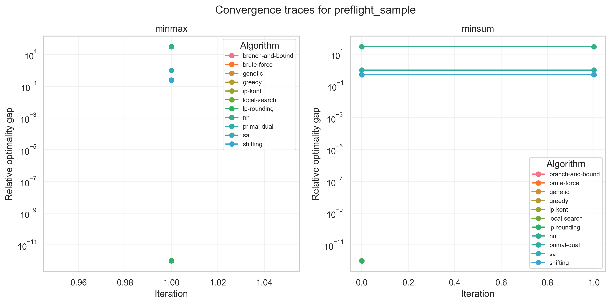

MinMax and MinSum relative-gap traces for preflight_sample. **Takeaway:** Falling curves indicate convergence to a smaller relative gap.

Vector PDF: [F1_convergence_preflight_sample.pdf](F1_convergence_preflight_sample.pdf)

### F2_convergence_grid

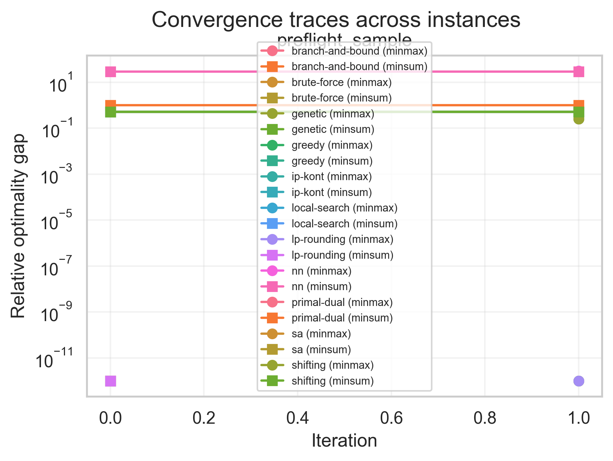

Per-instance overlay of MinMax and MinSum convergence traces. **Takeaway:** Compare convergence behavior across the full dataset.

Vector PDF: [F2_convergence_grid.pdf](F2_convergence_grid.pdf)

### G1_summary_dashboard

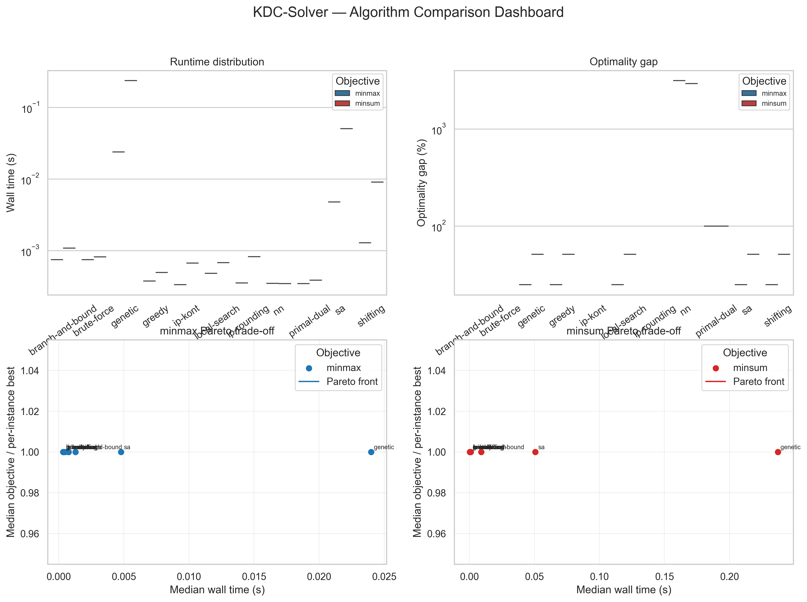

Dashboard combining runtime and gap distributions with objective-specific Pareto trade-offs. **Takeaway:** Trade-offs balance low runtime against low normalized objective.

Vector PDF: [G1_summary_dashboard.pdf](G1_summary_dashboard.pdf)

## Key findings

- Fastest by median runtime: **nn** (0.000348396 s).
- Lowest median optimality gap: **branch-and-bound** (0%).
- Most represented on aggregated Pareto fronts: **ip-kont**.
- Algorithms dominated on every comparable instance/objective: branch-and-bound by greedy, brute-force by greedy, genetic by branch-and-bound, greedy by nn, local-search by greedy, lp-rounding by ip-kont, sa by branch-and-bound, shifting by branch-and-bound.
